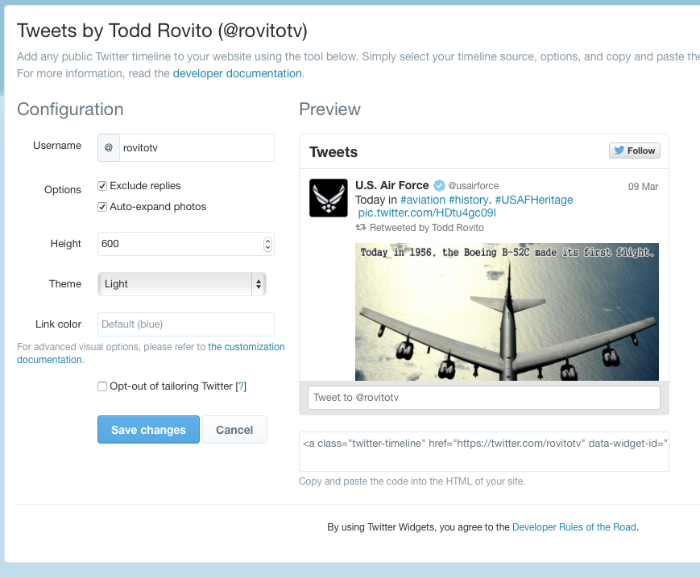

# Social Media Integration

Social media applications like Twitter and
Face Book are popular hence it might be a
fun experiment to integrate them with
your personal WordPress blog site. Plus by
integrating the two together your 
WordPress blog can drive your Twitter
feed and vice versa.  

## Getting your Twitter Feed on Your WordPress Blog

WordPress is an extremely powerful piece
of software with many customization
options.  Adding a Twitter feed is a
good example of just how powerful WordPress
can be.

### Generate the Twitter HTML Code

First using a web browser go to the following web site:

```bash
https://twitter.com/settings/widgets/new
```

This Twitter site will allow you to
generate a small piece of HTML code that
will run on Twitter's servers not your
Raspberry Pi.  Next you have to login with your Twitter account
then fill out the options which I just kept to the default then 
select the `Create widget` button.  Then you will notice at the bottom
a text box which has a bunch of HTML code which you need to highlight 
then copy into your clip board.  Here is a screen shot:



### Adding a Custom Text Widget for Twitter

Login to the site admin of your WordPress blog, then on the left side select
Appearance->Widgets.  Under the column Available Widgets select Text to add
a custom text widget.  Next decide which area you want your Twitter feed
to appear,  a little experimentation might be good but I have mine in the
`Primary Sidebar`.  Now select the `Add Widget` button.  Give the widget a
title then in the text box below the title paste the HTML code you got
from the Twitter site above.  The custom text widget will be added to the
bottom of the primary sidebar but you can move it to the location you
see fit.  
