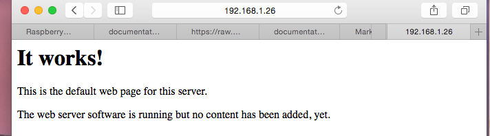
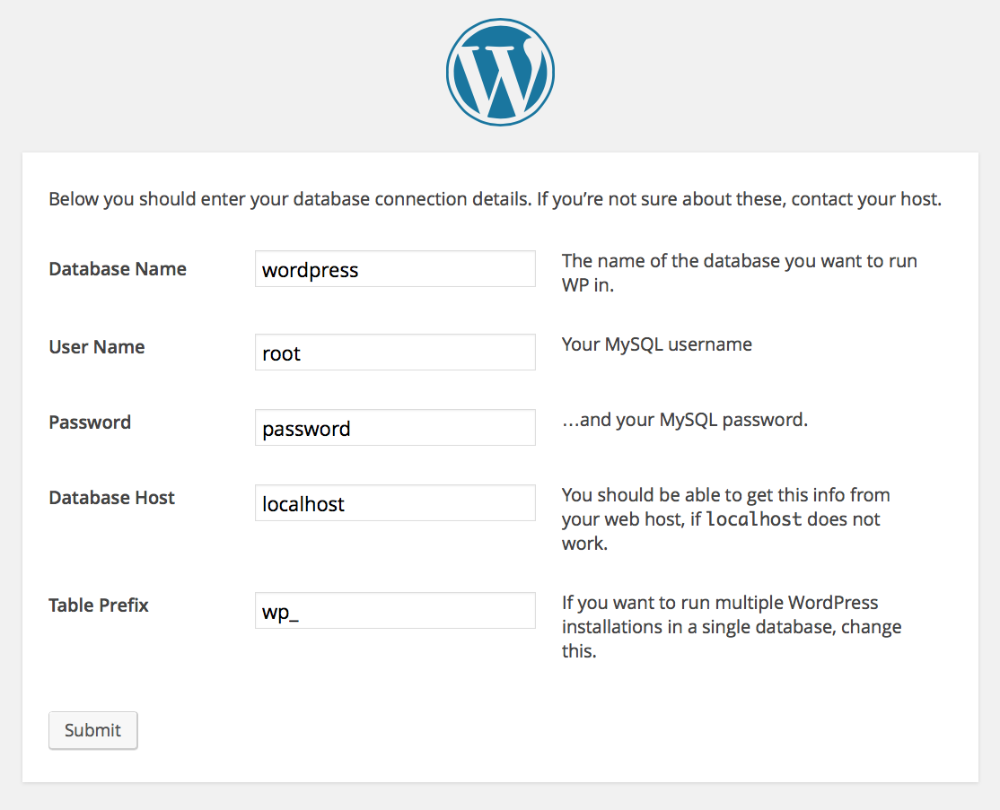

# Web

Having your own personal web server offers many freedoms like a blog and
webmail.  In this section you will install the Apache webserver, MySQL database,
PHP (a web scripting language), and finally Wordpress blogging software.  The
main digital freedom offered here is that you can post a blog post and not
have your readers have to suffer through advertisements.  Not only will your
blog be advertisement free but you will have massive amounts of storage space
and no file limits for media files.  The only file size limitation you will
have is based on how much storage space you can install on your Raspberry Pi.

## Apache Web Server

Apache is a popular open source web server that offers much flexibility and
excellent documentation.  As of June 2013 it is estimated that Apache serve 54%
of all active web sites.  On its own, Apache can serve HTML files over HTTP, and
with additional modules can serve dynamic web pages using scripting languages
such as PHP.  Apache is easy to install by typing in the  following command:

```bash
sudo apt-get install apache2 -y
```

## Testing the web server

By default, Apache puts a test HTML file in the web folder.  This default web
page is served when you browse to 'http://192.168.1.26' (or whatever your PI's
IP address is) from another computer on the network.  To find the PI's IP
address, type `hostname -I` at the command line. Find out more about your
PI's IP address see 
[IP Address](https://github.com/raspberrypi/documentation/blob/master/troubleshooting/hardware/networking/ip-address.md).

https://github.com/raspberrypi/documentation/blob/master/troubleshooting/hardware/networking/ip-address.md

Browse to the
default web page from another computer on the network and you should see
the following:



This means you have Apache working!

## Install PHP

PHP is a server-side scripting language designed for web development with
a very large install base.  Most "web apps" are created with PHP.  Latter on
we will install WordPress which uses PHP.  To allow your Apache server to
process PHP files, you'll need to install PHP5 and PHP5 module for Apache.
Type the following command to install these:

```bash
sudo apt-get install php5 libapache2-mod-php5 -y
```

## Testing PHP

To test PHP we will create a dynamic web page then refresh in our browser and
watch the time change.  First use this command to remove the default web page:

```bash
sudo rm /var/www/index.html
```

Then use the nano text editor to create a new index file which will be called
index.php.

```bash
sudo nano /var/www/index.php
```

Simply copy and paste the following PHP code 

```php
<?php echo date('Y-m-d H:i:s');
```

into the Nano text editor then exit with control-x.  An attempt to exit will
force  Nano to offer to save the file which you should select 'Y' for yes.  Now
browse to the default web page by going to 'http://192.168.1.26' (or whatever
your Pi's IP address is) from another computer on the network.  If you reload
the page you will notice that if PHP is installed correctly the date/time will
be updated.

## MySQL

MySQL (pronounced My Sequel or My S-Q-L) is a popular database engine. A 
database offers an easy way to store and retrieve data in a standard way using
the language SQL (structured query language).  Install the MySQL server and
PHP-MySQL packages by entering the following command into the terminal:

```bash
sudo apt-get install mysql-server php5-mysql -y
```

When installing MySQL you will be asked for a root password. You'll need to 
remember this to allow your website to access the database.  MySQL is a large
install so be patient as the database system is installed.

## Test MySQL

MySQL should install just fine but I like to confirm critical pieces of 
software are functioning so let's test the MySQL setup.  During the install
you should of entered a password for the "root" MySQL user.  A username of
root indicates administrator privileges so extra caution should
be used when using the root user for any system.  To test MySQL lets login to
the database with the following command:

```bash
mysql -u root -p
```

If you don't recieve any access denied messages then the database has been 
installed correctly.  The "-u" argument specifies the user and "-p" argument
asks for a password.  After you get the "mysql>" prompt simply type "quit" to
exit.

## WordPress

WordPress is a free and open-source blogging tool and a content management
system (CMS) which uses PHP and MySQL.  Features of WordPress include a 
plugin architecture and a template system.  According to 
[wikipedia](http://en.wikipedia.org/wiki/WordPress) WordPress is the Most
popular blogging system in use on the Web with more than 60 million websites.
Due to WordPress being so popular it has been known in the past to have several 
vulnerabilities.  In an effort to promote better security, and to streamline
the update experience overall, automatic background updates were introduced in
WordPress 3.7.  Users can also protect their WordPress installations by taking
steps such as keeping all WordPress installation, themes, and plugins updated,
and using only trusted themes and plugins.  This guide will walk through extra
security precautions latter on in the section.

Following the excellent instructions on 
[raspberrypi.org](http://www.raspberrypi.org/documentation/usage/wordpress/README.md) to
install WordPress the first step is to download the WordPress software from
[wordpress.org](http://wordpress.org/) using the wget command.  Using wget
from a terminal will copy the WordPress software straight to your Raspberry PI.
Helpfully, a copy of the latest version of WordPress is always available at
[wordpress.org/latest.tar.gz](http://wordpress.org/latest.tar.gz) so you can
grab the latest version without having to look it up on the website. 

Navigate to `/var/www/`, and download WordPress to this location. You'll need to
empty the folder first (be sure to check you're not deleting files you need
before running `rm`); change the ownership of this folder to the `pi` user too.

```bash
cd /var/www
sudo chown www-data: .
rm *
wget http://wordpress.org/latest.tar.gz
```

Now extract the tarball, move the contents of the folder it extracted
(`wordpress`) to the current directory and remove the (now empty) folder and the
tarball to tidy up:

```bash
tar xzf latest.tar.gz
mv wordpress/* .
rm -rf wordpress latest.tar.gz
```

Running the `ls` or (`tree -L 1`) command here will show you the contents of a
WordPress project:

```bash
.
├── index.php
├── license.txt
├── readme.html
├── wp-activate.php
├── wp-admin
├── wp-blog-header.php
├── wp-comments-post.php
├── wp-config-sample.php
├── wp-content
├── wp-cron.php
├── wp-includes
├── wp-links-opml.php
├── wp-load.php
├── wp-login.php
├── wp-mail.php
├── wp-settings.php
├── wp-signup.php
├── wp-trackback.php
└── xmlrpc.php
```

This is the source of a default WordPress installation. The files you edit to
customize your installation belong in the `wp-content` folder.

### Your WordPress database

To get your WordPress site set up, you need a database. Run the `mysql` command
in the terminal, and provide your login credentials (e.g. username `root`,
password `password`):

```bash
mysql -uroot -ppassword
```

Here I have provided my password (the word `password`) on the command line;
there is no space between `-p` and your password.

Alternatively you can simply supply an empty `-p` flag and wait to be asked for
a password:

```bash
mysql -uroot -p
```

Now you will be prompted to enter the root user password you created earlier.

Once you're connected to MySQL, you can create the database your WordPress
installation will use:

```
mysql> create database wordpress;
```

Note the semicolon ending the statement. On success you should see the following
message:

```
Query OK, 1 row affected (0.00 sec)
```

Exit out of the MySQL prompt with `Ctrl + D`.

### WordPress configuration

You need to find out your Pi's IP address to access it in the browser, so in a
terminal type the command `hostname -I`.

Navigate to `http://YOUR-IP-ADDRESS` e.g. `http://192.168.1.5` in your web
browser.

You should see a WordPress Error page; this is good! Click the big button marked
`Create a Configuration File` followed by the `Let's go!` button on the next
page.

Now fill out the basic site information as follows:

```
Database Name:      wordpress
User Name:          root
Password:           <YOUR PASSWORD>
Database Host:      localhost
Table Prefix:       wp_
```

Upon successful database connection, you will be given the contents of your `wp-
config.php` file:



Copy this text, return to the terminal on the Pi and edit the file with `nano
wp-config.php`. Paste the text into this file, and save and exit with `Ctrl +
X`, then `Y` for yes and `Enter`.

Now hit the `Run the install` button.

#### Welcome screen

Now you're getting close.


Fill out the information: give your site a title, create a username and
password, put in your email address and untick the search engines box. Hit the
`Install WordPress` button, then log in using the account you just created.

Now you're logged in and have your site set up, you can see the website by
visiting your IP address in the browser on the Pi or another computer on the
network. To log in again (or on another computer), go to `http://YOUR-IP-ADDRESS
/wp-admin`.

#### Setup Friendly Links

It's recommended that you change your permalink settings to make your URLs more
friendly. To do this, log in to WordPress and go to the dashboard. Go to
`Settings` then `Permalinks`. Select the `Post name` option and click `Save
Changes`. After saving, you will be prompted to update your `.htaccess` file.
You probably don't have one yet, so add one in `/var/www/` by typing `nano
.htaccess`; note this is a hidden file, so it starts with a dot. Then paste in
the contents provided:

```
<IfModule mod_rewrite.c>
RewriteEngine On
RewriteBase /
RewriteRule ^index\.php$ - [L]
RewriteCond %{REQUEST_FILENAME} !-f
RewriteCond %{REQUEST_FILENAME} !-d
RewriteRule . /index.php [L]
</IfModule>
```

Save the file and return to the website homepage. Click on the post title or the
sample page link and you'll probably see a `Not Found` error page. This is
because the `rewrite` module has not been enabled in Apache. To do this, enter
`sudo a2enmod rewrite`.

You'll also need to tell the virtual host serving the site to allow requests to
be overwritten. Do this by editing the virtual host file (with root
permissions): `sudo nano /etc/apache2/sites-available/default`; also, change the
`AllowOverride` setting on line 11 (inside the `<Directory /var/www/>` block)
from `None` to `All`. Save the file and then restart Apache with `sudo service
apache2 restart`. Once it's restarted, refresh the page and it should load
successfully. Now posts have URLs like `/hello-world/` instead of `/?p=123`, and
pages have URLs like `/sample-page/` instead of `/?page_id=2`.

One nice feature of WordPress is it allows you to edit images with a web 
browser but you need to install GD module for php5.  Installing GD module for
php5 is easy by using the command `sudo apt-get install php5-gd`.

# Conclusion

Now you have your own website and control the content.  Have fun blogging see
the WordPress site for more instructions on how to use 
[wordpress.org](http://codex.wordpress.org/WordPress_Lessons).


